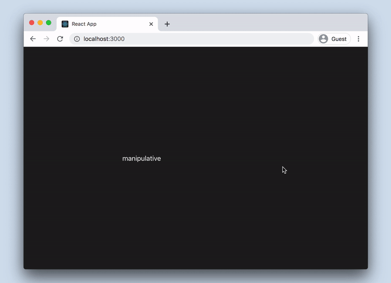

# manipulative

A React devtool for live-updating [Emotion](https://emotion.sh/) styles in the browser. When the styles look good, write them to your source files with one click.



> manipulative is currently alpha-quality software. If manipulative is not working for your use case, please file an issue and I'll try my best to help.

## Requirements

- You're using `@emotion/react` with [`css` prop](https://emotion.sh/docs/css-prop)
- You're using React Fast Refresh (included w/ [create-react-app](https://create-react-app.dev/) 4+)

## Installation

```sh
npm install --dev manipulative
# or
yarn add --dev manipulative
```

## Usage

### Run server

The server writes changes to your source files.

```sh
npx manipulative-server
```

### Invoke manipulative

Use one of these two approaches.

1. `useCssPlaceholder()` - quickest but not ideal

If you have a create-react-app, you can use the Babel macro without any setup. Add calls to `useCssPlaceholder()` on elements you want to style.

```js
import { useCssPlaceholder } from "manipulative/macro";

function MyComponent() {
  return (
    <div css={useCssPlaceholder()}>
      <p css={useCssPlaceholder()}>...</p>
    </div>
  );
}
```

2. `css__` prop

This more convenient approach requires a little Babel setup ([see below](#recommended-babel-setup)).

```js
// no need to import anything
function MyComponent() {
  return (
    <div css__>
      <p css__>...</p>
    </div>
  );
}
```

### Modify and commit styles

In the browser, you should see the manipulative inspector with an input for each `useCssPlaceholder()` or `css__` prop. Type CSS in the textarea to see styles update live. Click "commit" to write changes back to the source files, replacing `useCssPlaceholder()` and `css__` props.

Be sure to remove any imports from `manipulative` when building for production!

## Recommended Babel setup

If you want to use the more convenient `css__` syntax, you'll need to install a Babel plugin that runs before React Fast Refresh.

If you have access to the Webpack config (e.g. you ejected CRA), add `manipulative/babel` to the list of Babel plugins. This plugin needs to run before `react-refresh/babel`.

```
{
  loader: 'babel-loader',
  plugins: [
    'manipulative/babel',
    'react-refresh/babel',
  ],
  ...
}
```

If you have not ejected CRA, you can still use this plugin with something like [react-app-rewired](https://github.com/timarney/react-app-rewired). Here is an example `config-overrides.js` with `react-app-rewired`.

```js
const { getBabelLoader } = require("customize-cra");

module.exports = function override(config) {
  getBabelLoader(config).options.plugins.unshift(
    require.resolve("manipulative/plugin")
  );
  return config;
};
```

## Known Limitations

- manipulative only supports static styles. It does not handle functions or JS variables.
- `css__` cannot be used with `css` prop on the same element
  - `css__` is transformed to `css={...}`. Therefore, one will override the other. There may be support for modifying existing styles in the future.
